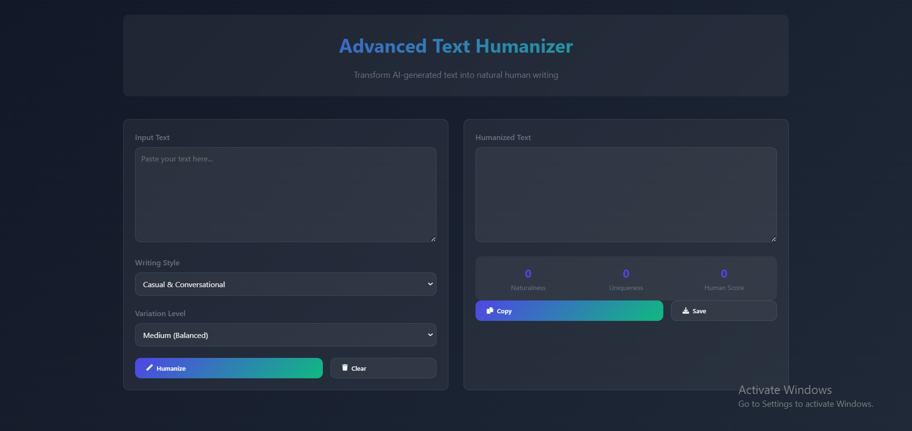

# Advanced Text Humanizer 🎯

A sophisticated web application that transforms AI-generated or formal text into more natural, human-like writing. This tool uses advanced language processing techniques to make text feel more authentic while maintaining its original meaning.

## ✨ Features

- **Multiple Writing Styles**
  - Casual & Conversational
  - Semi-Formal
  - Professional
  - Academic

- **Customizable Variation Levels**
  - Low (Subtle Changes)
  - Medium (Balanced)
  - High (Significant Changes)

- **Real-time Metrics**
  - Naturalness Score
  - Uniqueness Rating
  - Overall Human Score

- **Text Processing Capabilities**
  - Smart sentence restructuring
  - Natural language patterns
  - Context-aware transitions
  - Intelligent variation addition

## 🚀 Getting Started

### Prerequisites

- Modern web browser (Chrome, Firefox, Safari, Edge)
- No additional installations required

### Usage

1. **Input Text**
   - Paste your text into the input field
   - Select desired writing style
   - Choose variation level

2. **Process Text**
   - Click "Humanize" button
   - View transformed text in output field
   - Check quality metrics

3. **Export Results**
   - Copy to clipboard
   - Download as text file

## 💡 How It Works

The Text Humanizer employs several sophisticated algorithms to transform text:

### Language Pattern Analysis
- Identifies formal structures
- Applies natural language patterns
- Adds appropriate transitions

### Style Adaptation
- Adjusts tone based on selected style
- Incorporates style-specific phrases
- Maintains consistency throughout

### Sentence Variety
- Combines short sentences
- Adds natural transitions
- Varies sentence structure

## 🎨 Customization Options

### Writing Styles

- **Casual & Conversational**
  - Perfect for blog posts and social media
  - Uses contractions and informal language
  - Adds conversational markers

- **Semi-Formal**
  - Ideal for business communications
  - Balances professionalism with accessibility
  - Maintains engaging tone

- **Professional**
  - Suited for formal business documents
  - Emphasizes clarity and precision
  - Preserves professional tone

- **Academic**
  - Optimized for academic writing
  - Incorporates scholarly language
  - Maintains academic rigor

### Variation Levels

- **Low**
  - Minimal changes to original text
  - Focuses on basic naturalness
  - Preserves original structure

- **Medium**
  - Balanced transformations
  - Moderate sentence restructuring
  - Natural language additions

- **High**
  - Significant rewording
  - Enhanced sentence variety
  - Maximum naturalness

## 📊 Quality Metrics

### Naturalness Score
- Measures sentence variety
- Analyzes language patterns
- Evaluates flow and readability

### Uniqueness Rating
- Assesses word variety
- Checks for repetition
- Measures vocabulary richness

### Human Score
- Combines multiple metrics
- Provides overall quality rating
- Indicates text authenticity

## 🛠️ Technical Details

Built with:
- HTML5
- CSS3
- Vanilla JavaScript
- Font Awesome icons

Features:
- Responsive design
- Modern glassmorphism UI
- Real-time processing
- Error handling

## 🌟 Acknowledgments

- Inspired by natural language processing techniques
- UI design influenced by modern web trends
- Special thanks to all contributors

---
Made with ❤️ for the open-source community
