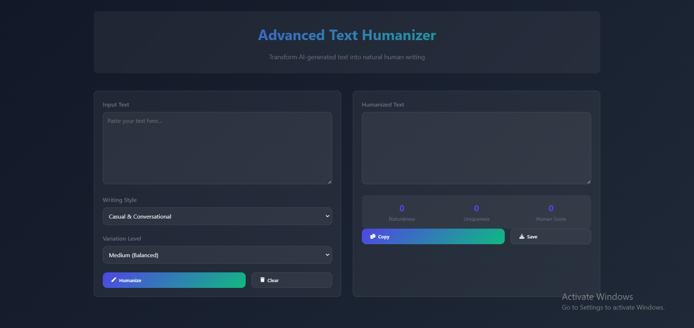

# 🌟 Advanced Text Humanizer 🌟  

A **modern web application** designed to transform **AI-generated or overly formal text** into **natural, human-like writing**. This project harnesses **language processing techniques** to ensure readability, variety, and creativity, while maintaining the **original meaning** of the input text.

 <!-- Replace with your actual screenshot if needed -->

---

## ✨ Features  
- 🔍 **Multiple Writing Styles:**  
  Choose from **Casual**, **Semi-Formal**, **Professional**, and **Academic** tones to suit different audiences.  

- 🎨 **Text Variation Levels:**  
  Adjust the level of transformation—choose between **Low (subtle changes)**, **Medium (balanced)**, or **High (significant changes)**.  

- 📊 **Real-Time Text Metrics:**  
  Measure **Naturalness**, **Uniqueness**, and the overall **Human Score** to evaluate text quality.  

- ⚙️ **Built-In Enhancements:**  
  - **Naturalization:** Replaces overly formal structures with more conversational language.  
  - **Sentence Variety:** Improves flow by combining or splitting sentences where necessary.  
  - **Filler and Transition Words:** Adds natural phrases for a more human touch.  

- 💾 **Save and Copy Options:**  
  - Easily **copy** the generated text or **download** it as a `.txt` file.  

---

## 📸 Application Interface
### Key Sections:
1. **Input Text Area:** Enter or paste the AI-generated/formal text to be transformed.  
2. **Style Selection Dropdown:** Choose the desired writing style for the transformation.  
3. **Variation Level Selector:** Adjust how extensive the transformation should be.  
4. **Metrics Panel:** View scores for Naturalness, Uniqueness, and Human Score after processing.  

 <!-- Replace with your actual screenshot -->

---

## 🚀 **Live Demo**
[**Launch Advanced Text Humanizer**](https://example.com) <!-- Replace with your actual link -->

---

## 🛠️ **Getting Started**
To run this project locally, follow these instructions:

### 1️⃣ Clone the Repository
```bash
git clone https://github.com/username/advanced-text-humanizer.git
cd advanced-text-humanizer
